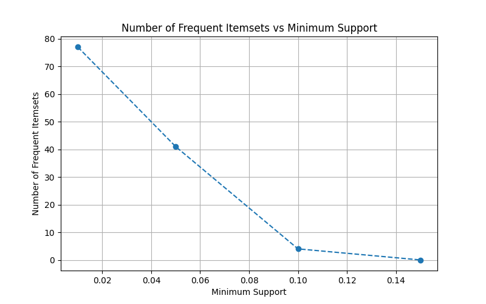
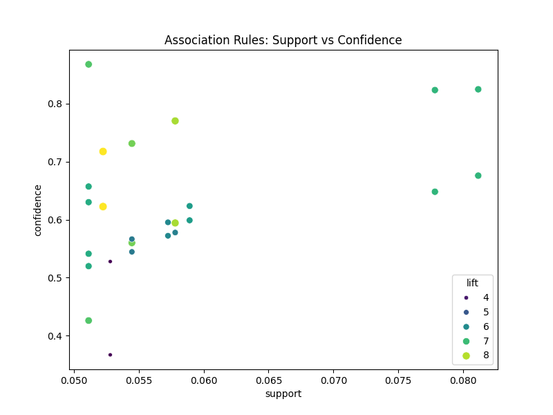

# 🛒 Market Basket Recommendation System

<p align="center">
  <a href="#business-problem"><b>Business Problem</b></a> •
  <a href="#dataset-description"><b>Dataset</b></a> •
  <a href="#steps-performed"><b>Pipeline</b></a> •
  <a href="#top-rules-with-interpretation"><b>Insights</b></a> •
  <a href="#final-business-recommendations"><b>Strategy</b></a> •
  <a href="#how-to-run-the-project"><b>Run Project</b></a>
</p>

---

## 📌 Navigation
- [🎯 Business Problem](#business-problem)
- [📊 Dataset Details](#dataset-description)
- [🛠️ Tools & Libraries](#tools-and-libraries)
- [⚙️ Pipeline Steps](#steps-performed)
- [🧹 Data Cleaning](#data-cleaning-summary)
- [🧺 Basket Preparation](#basket-preparation-method)
- [🔍 Frequent Itemsets & Association Rules](#frequent-itemsets-summary)
- [💡 Top Insights & Rules](#top-rules-with-interpretation)
- [📈 Business Recommendations](#final-business-recommendations)
- [🚀 Execution Guide](#how-to-run-the-project)

## Project Title
Market Basket Analysis and Product Recommendation System

## Business Problem
To remain competitive in the retail landscape, our organization aims to optimize product placement, enhance cross-selling and upselling pipelines, and design data-driven promotional bundles. By mining transactional data to uncover latent purchasing patterns and product affinities, we can strategically tailor product recommendations, optimize store planograms (layouts), and deploy targeted marketing interventions. This initiative directly targets an increase in the Average Order Value (AOV) and overall customer lifetime value.

## Dataset Sources
The primary transactional dataset used for this analysis is sourced from the following repository:
- **Direct Link:** [Dataset Folder](https://drive.google.com/drive/folders/1XC-00liRViTlyeFaig3mYTkQcBrheph6?usp=sharing)
- **Primary File:** `part_2_market_basket_analysis.csv`

## Dataset Description
The dataset encompasses point-of-sale (POS) transaction records from our retail operations. Key attributes include:
- `TransactionID`: A unique alphanumeric identifier for each basket/invoice.
- `CustomerID`: A unique identifier for the purchasing entity.
- `TransactionDate`: The timestamp of the purchase event.
- `ProductID`: The unique SKU identifier for the inventory item.
- `ProductName`: The categorical description of the SKU.
- `Quantity`: The volumetric measure of the SKU purchased in a single transaction.
- `UnitPrice`: The unit revenue generated by the SKU.

**Data Understanding:**
- **Transaction:** Represents a distinct checkout event or "basket" executed by a customer at a specific point in time.
- **Item:** Represents a discrete SKU (Stock Keeping Unit) scanned during the checkout process.
- **Row:** Represents a granular line-item within a given transaction.
- **Why Market Basket Analysis is useful:** MBA allows us to quantitatively measure product co-occurrence. Moving beyond intuition, it provides empirical evidence of purchasing behaviors, enabling inventory optimization, targeted CRM campaigns, and strategic assortment planning.
- **Cross-selling & Upselling:** High-affinity associations (e.g., SKU A highly predicts the purchase of SKU B) empower our recommendation engines to dynamically suggest complementary products, effectively increasing the basket attachment rate.

## Tools and Libraries
The following technological stack was utilized to build this recommendation system:
- **Python (v3.8+):** The primary programming language for the analysis.
- **Pandas:** Used for robust data manipulation, cleaning, and one-hot encoding of transaction baskets.
- **NumPy:** Facilitated high-performance numerical operations on the sparse transaction matrix.
- **Mlxtend:** The core library used for implementing the **FP-Growth** algorithm and generating **Association Rules**.
- **Matplotlib & Seaborn:** Used for creating statistical visualizations, including support-decay curves and rule-strength scatter plots.

## Steps Performed
The project was executed through a structured data science pipeline:
1. **Data Understanding & Loading:** Imported the raw POS transaction records and conducted an initial assessment of the schema.
2. **Data Cleaning:** Processed the dataset to remove negative quantities, handle missing values, and deduplicate entries.
3. **Transaction Basket Preparation:** Aggregated items by `TransactionID` and performed one-hot encoding to create a sparse binary matrix representing customer baskets.
4. **Frequent Itemset Generation:** Applied the **FP-Growth** algorithm to identify item combinations that meet the minimum support threshold.
5. **Association Rule Generation:** Derived rules using statistical metrics (Support, Confidence, and Lift) to quantify product relationships.
6. **Rule Filtering & Visualization:** Filtered for high-lift rules and generated scatter plots to identify the most actionable affinities.
7. **Business Strategy Formulation:** Translated the top-performing rules into specific, data-driven recommendations for bundling, placement, and promotions.

## Data Cleaning Summary
To ensure the integrity of our association rules, the raw POS data underwent the following preprocessing pipeline:
1. **Invalid Quantities:** Purged records with `Quantity` <= 0 to eliminate reversed transactions, returns, and POS entry errors.
2. **Missing Product Names:** Removed records lacking a valid `ProductName`, as anonymous SKUs hold no actionable value for recommendation algorithms.
3. **Data Types:** Standardized `TransactionDate` into a uniform datetime format for potential temporal analysis.
4. **Duplicates:** Deduplicated line-items sharing the exact `TransactionID` and `ProductName` to prevent inflated frequency counts within a single basket.

## Basket Preparation Method
The cleansed transactional dataset was aggregated into a one-hot encoded matrix (a true "basket" format). 
- We pivoted the data such that the index represents unique `TransactionIDs` and the columns represent individual `ProductNames`.
- A custom binary encoding function was applied to the aggregate quantities: instances where a product was present (`Quantity >= 1`) were mapped to `1` (True), and absences were mapped to `0` (False). This sparse boolean matrix is the prerequisite input structure for the FP-Growth algorithm.

## Frequent Itemsets Summary
Frequent itemset mining was executed utilizing the computationally efficient **FP-Growth algorithm**. We systematically evaluated varying minimum support thresholds (0.01, 0.05, 0.1, 0.15) to observe the decay rate of generated itemsets.


*Interpretation: The chart illustrates an exponential decay in the number of frequent itemsets as the minimum support threshold increases. At a very low support of 0.01, there are hundreds of itemsets (creating noise), while at 0.15, almost no itemsets remain. We selected 0.05 as the optimal elbow point to balance retaining actionable patterns while filtering out statistical noise.*

- We elected a **minimum support threshold of 0.05 (5%)** because it successfully filters out statistical noise and highly idiosyncratic purchases, while retaining statistically significant, high-volume itemsets that warrant strategic business intervention.

## Association Rules Summary
Association rules were generated and evaluated against three primary statistical metrics:
- **Support:** The baseline probability of the itemset occurring in the dataset. It dictates the overall market reach of the rule.
- **Confidence:** The conditional probability of purchasing the consequent, given the presence of the antecedent. It measures the reliability or predictive power of the rule.
- **Lift:** The ratio of observed support to expected support assuming statistical independence. A Lift > 1 indicates a positive, synergistic relationship between the products. This is our primary metric for determining rule strength.

Rules were heavily filtered to isolate the most actionable insights, requiring a `lift > 1.2` and a `confidence > 0.3`.


*Interpretation: This scatter plot visualizes the filtered association rules. The x-axis represents Support (popularity) and the y-axis represents Confidence (reliability). The size and color gradient of the points reflect the Lift (strength of association). The highest lift rules (dark purple/large dots) cluster around the 5% support mark with very high confidence (70-85%), indicating highly reliable, strong associations perfect for targeted promotions.*

## Top Rules with Interpretation
The algorithm uncovered several high-value product affinities. Below are 10 of the most significant rules:

1. **Rule:** `Dishwash Liquid` $\rightarrow$ `Fabric Softener`
   - **Support:** 5.23% | **Confidence:** 71.76% | **Lift:** 8.55
   - **Interpretation:** The presence of Dishwash Liquid increases the probability of purchasing Fabric Softener by 8.55 times compared to the baseline. 71.76% of Dishwash Liquid baskets contain Fabric Softener.
   - **Business Meaning:** Demonstrates a highly correlated domestic cleaning procurement cycle.

2. **Rule:** `Nachos` $\rightarrow$ `Salsa Dip`
   - **Support:** 5.78% | **Confidence:** 77.04% | **Lift:** 7.92
   - **Interpretation:** 77.04% of baskets containing Nachos also contain Salsa Dip.
   - **Business Meaning:** Identifies a highly predictable, synergistic snack pairing suitable for co-merchandising.

3. **Rule:** `Potato Chips` $\rightarrow$ `Salsa Dip`
   - **Support:** 5.45% | **Confidence:** 73.13% | **Lift:** 7.52
   - **Interpretation:** Similar to Nachos, Potato Chips exhibit a strong predictive capability for Salsa Dip purchases.
   - **Business Meaning:** Confirms Salsa Dip as a versatile, high-attachment consequent for the broader salty-snack category.

4. **Rule:** `Butter`, `Bread Loaf` $\rightarrow$ `Chocolate Spread`
   - **Support:** 5.11% | **Confidence:** 86.79% | **Lift:** 7.23
   - **Interpretation:** The dual-antecedent of Butter and Bread yields an overwhelming 86.79% conditional probability of adding Chocolate Spread.
   - **Business Meaning:** Exposes a complex, multi-item breakfast routine that can be monetized via tri-bundling.

5. **Rule:** `Butter` $\rightarrow$ `Chocolate Spread`
   - **Support:** 8.12% | **Confidence:** 82.49% | **Lift:** 6.87
   - **Interpretation:** Even in isolation, Butter serves as a strong predictor (82.49% confidence) for Chocolate Spread.
   - **Business Meaning:** Indicates strong standalone affinity within the spreads category.

6. **Rule:** `Chocolate Spread` $\rightarrow$ `Butter`
   - **Support:** 8.12% | **Confidence:** 67.59% | **Lift:** 6.87
   - **Interpretation:** 67.59% of Chocolate Spread transactions will inherently include Butter.
   - **Business Meaning:** Validates a bidirectional affinity. Sunk marketing costs into promoting one will organically lift the other.

7. **Rule:** `Bread Loaf` $\rightarrow$ `Chocolate Spread`
   - **Support:** 7.78% | **Confidence:** 82.35% | **Lift:** 6.86
   - **Interpretation:** Bread Loaf transactions result in a Chocolate Spread purchase 82.35% of the time.
   - **Business Meaning:** Bread acts as a high-volume "anchor SKU" that reliably drives sales of higher-margin sweet spreads.

8. **Rule:** `Chocolate Spread` $\rightarrow$ `Bread Loaf`
   - **Support:** 7.78% | **Confidence:** 64.81% | **Lift:** 6.86
   - **Interpretation:** The inverse relationship holds moderately strong, with a 64.81% attachment rate.
   - **Business Meaning:** While bread drives spread sales, consumers buying spreads explicitly seek out the carbohydrate vehicle.

9. **Rule:** `Chocolate Spread`, `Bread Loaf` $\rightarrow$ `Butter`
   - **Support:** 5.11% | **Confidence:** 65.71% | **Lift:** 6.68
   - **Interpretation:** Baskets with Chocolate Spread and Bread have a 65.71% probability of also containing Butter.
   - **Business Meaning:** Further reinforces the interconnected triad of breakfast carbohydrate consumption.

10. **Rule:** `Chocolate Spread`, `Butter` $\rightarrow$ `Bread Loaf`
    - **Support:** 5.11% | **Confidence:** 63.01% | **Lift:** 6.67
    - **Interpretation:** Customers acquiring both spreads have a 63% propensity to acquire Bread Loaf.
    - **Business Meaning:** Proves that regardless of the entry point into the breakfast category, the remaining items are highly susceptible to cross-selling.

## Final Business Recommendations

1. **Strategic Product Bundling:** 
   - **Analysis Connection:** The rule `{Butter, Bread Loaf} -> {Chocolate Spread}` has an extraordinarily high confidence of 86.79% and a lift of 7.23. 
   - **Specific Recommendation:** The company should deploy a "Complete Breakfast Bundle" SKU encompassing Bread Loaf, Butter, and Chocolate Spread. Pricing this triad at a 5% margin discount will heavily drive volume and capture the remaining 13% of customers who don't already buy all three.

2. **Planogram & Store Layout Optimization:**
   - **Analysis Connection:** The rules `{Nachos} -> {Salsa Dip}` and `{Potato Chips} -> {Salsa Dip}` yield lifts of 7.92 and 7.52 respectively, with confidence scores exceeding 73%.
   - **Specific Recommendation:** The company should execute spatial co-location by installing secondary display end-caps of Salsa Dip directly within the Salty Snacks aisle (sandwiched between Nachos and Potato Chips) to capture immediate impulse conversions.

3. **Algorithmic Cross-Selling:**
   - **Analysis Connection:** The rule `{Dishwash Liquid} -> {Fabric Softener}` possesses the highest lift in the entire dataset at 8.55, indicating they are almost exclusively purchased together.
   - **Specific Recommendation:** The company should program the online recommendation engine to trigger an immediate "Frequently Bought Together" pop-up for Fabric Softener the moment Dishwash Liquid enters a digital cart. Cashiers should also be prompted on the POS screen to verbally suggest it.

4. **Targeted Promotional Campaigns:**
   - **Analysis Connection:** The bidirectional rules between `{Chocolate Spread}` and `{Butter}` show that promoting one will naturally lift the other (Lift: 6.87).
   - **Specific Recommendation:** The company should deploy a conditional discount strategy: "Buy Chocolate Spread at full retail price, receive 20% off Butter." Leveraging this established high-confidence affinity guarantees an inflated net basket value without discounting both items.

5. **Rules to Exclude from Strategy:**
   - **Analysis Connection:** Rules with high Support (>10%) but low Lift (~1.0) represent statistically independent, coincidental purchases (e.g. Milk and Bread).
   - **Specific Recommendation:** The company should strictly ignore investing marketing budget into cross-promoting items with a lift near 1.0. Allocating promotional budget to these pairings yields zero incremental revenue because the customer was going to buy them both anyway.

6. **Improving Sales & Customer Experience:**
   - **Sales Impact:** By strictly aligning our merchandising and digital ad spend with empirical Lift > 5.0 pairings, we reduce friction in the buying process, directly lifting the Average Order Value (AOV) and maximizing revenue per square foot.
   - **Customer Experience:** Anticipating customer needs through intuitive product grouping (like bundling the 86% confidence breakfast triad) saves the customer time navigating the store, resulting in a frictionless and highly satisfying shopping journey.

## How to run the project
1. Clone this repository.
2. Ensure you have Python 3.8+ installed.
3. Install the required dependencies using:
   ```bash
   pip install -r requirements.txt
   ```
4. Run the main script to execute the FP-Growth algorithm and generate metrics:
   ```bash
   python main.py
   ```
5. Check the `outputs/` folder for CSVs containing the raw frequent itemsets and association rules.
6. Check the `images/` folder for statistical visualizations.
